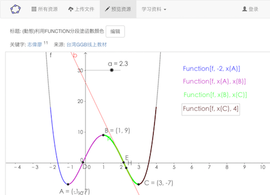

# ggblib

Interactive mathematics materials based on [GeoGebra][ggb] and AngularJS.

[The site][ggblib] is used for web acceleration and convenient use
in China and for non-commercial use.

 

## Build

You'll need [node and npm][npm] installed.
Also make sure that [bower][bower] and [grunt][grunt] are installed:

```
npm install bower -g
npm install grunt-cli -g
```

Now, install the [packages][packages] needed by this project:

```
npm install
```

Then, preview on the browser (Chrome is recommended).

```
grunt serve
```

## License

This project is licensed under [GPL v3][gpl] and [GeoGebra Non-commercial License][ggb-lisence].

[ggb]: https://www.geogebra.org
[npm]: https://docs.npmjs.com/getting-started/installing-node
[bower]: http://bower.io
[grunt]: http://gruntjs.com/getting-started
[packages]: doc/dependencies.md
[gpl]: http://www.gnu.org/licenses/gpl-3.0.html
[ggblib]: http://rhcad.com/ggblib
[ggb-lisence]: http://www.geogebra.org/license/
